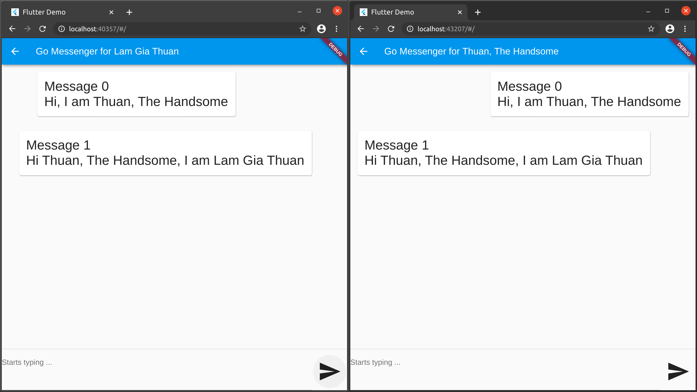

# Go + gRPC + Flutter = Awesome Chap App

## Goals
I want to learn **GO** by building a small chat app with Go backend, Websocket or gRPC (*in consideration*) and React + Material UI or Flutter (*in cosideration*) frontend.

Why? My research suggested that Go is best for web application backend and microservices. The frontend is hence needed and a good way to transfer data is also very important.

## Learning Goals
 - [x] Practical and complete understanding of Mutex.
 - [x] First experience with router and navigator.
 - [x] Basics of the incredibly powerful gRPC.
 - [x] Basics of Go and concurrency with Go.
 - [x] Basics of the absolutely stunning Flutter.
 - [ ] Using Google Firebase for UI hosting.
 - [ ] Database workflow and patterns in Go.
 - [ ] Generic understanding of middlewares.
 - [ ] Dockerization of server and client.
 - [ ] Deployment to cloud.

## Current Problems
 - [x] GRPC doesn't work well for WEB -> gRPC-Web.
 - [x] Server streaming not working for grpc/grpc_web.dart -> NEVER end stream function.

## Tasks
 - [x] Auto-generate models in Go and JS -> the pain of rewriting the same stuff in the client-side -> gRPC + protobuf 3.
 - [x] Play with Flutter Web -> incredible but some problems with releasing.
 - [x] Test if Go can publish a web UI -> by http.FileServer.
 - [x] ~~Test websocket communication -> by gorilla/websocket.~~ (outdated)
 - [ ] Use a docker database to persist data.
 - [ ] Build a non-compromised chat UI.
 - [ ] Implement all key features.
 - [ ] Deploy to a docker image.
 - [ ] Deploy to Google Cloud.

## Photos

